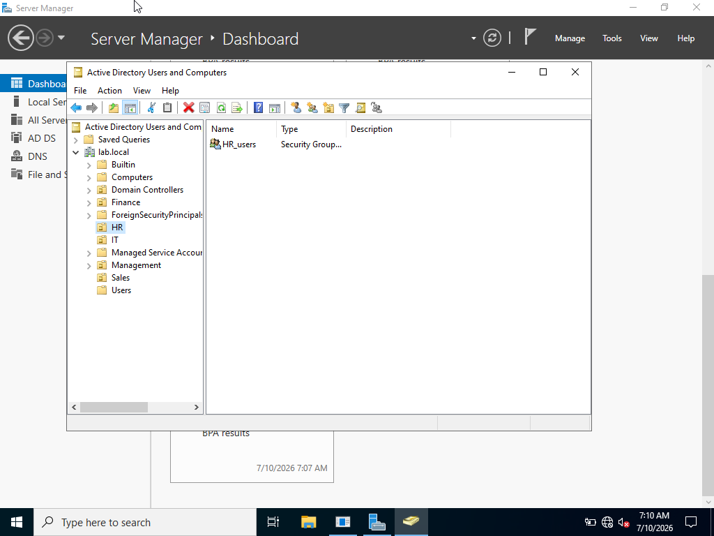
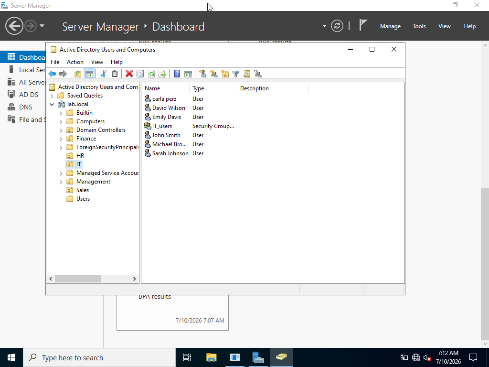

# Active Directory Documentation

## Organizational Units

An IT Organizational Unit was created to simulate a department environment. Five user accounts were created and organized within the IT OU to demonstrate Active Directory user management.

## Active Directory Structure

The Active Directory environment was organized using Organizational Units to separate and manage users.

## IT User Accounts

Five user accounts were created inside the IT Organizational Unit to simulate employees within an organization.

